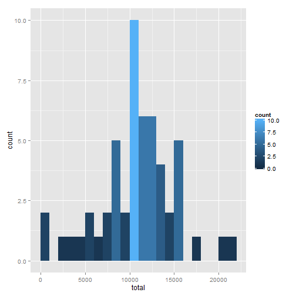
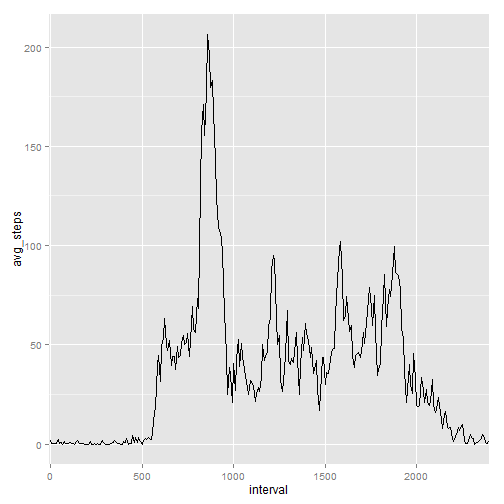
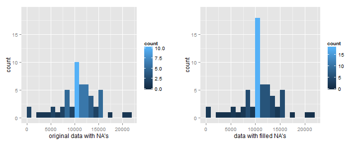

Reproducible Research: Peer Assessment 1
============================================================
### *Ricardo Merino Raldua*
**Saturday, October 19, 2014**

**Github repo with RMarkdown source code:** [github.com/Nykter/RepData_PeerAssessment1](https://github.com/Nykter/RepData_PeerAssessment1)

<br>

## Summary

This document presents the results of the Reproducible Research Peer Assessment 1 in a report using knitr and transforming an R Markdown document into an HTML file.

Through this report you can see that activities on weekdays mostly follow a work related routine with a pronounced peak maybe related to a sport routine, and a more regular distribution of activity on weekends.

<br>

## Prepare the environment

Load "knitr", "gridExtra", "ggplot2", "plyr" and "dplyr" packages. And set "echo", "results" and "tidy" as global options for knitr.


```r
library(knitr)
library(gridExtra)
library(ggplot2)
library(plyr)
library(dplyr)
opts_chunk$set(echo = TRUE, results = "hold", tidy = TRUE)
```

<br>

## Loading and preprocessing the data

This assignment makes use of data from a personal activity monitoring device. This device collects data at 5 minute intervals throughout the day. The data consists of two months of data from an anonymous individual and include the number of steps taken in 5 minute intervals each day.

To load and preprocess the data, I proceed as follows:

1. Check if the .zip file already exists in the working directory and if not download it from the [link](https://d396qusza40orc.cloudfront.net/repdata%2Fdata%2Factivity.zip) stated in the assessment.
2. Unzip the .zip file.
3. Read the .csv file defining the columns classes.
      + Set column "interval" as factor.
      + Set column "date" as Date.
4. Assign the result to the variable 'tbl'.


```r
read_data <- function() {
    file_name = "activity.zip"
    Url = "https://d396qusza40orc.cloudfront.net/repdata%2Fdata%2Factivity.zip"
    if (!file.exists(file_name)) {
        download.file(Url, destfile = file_name)
    }
    csv_file <- unz(file_name, "activity.csv")
    tbl <- read.csv(csv_file, header = T, colClasses = c("numeric", "character", 
        "numeric"))
    tbl$interval <- factor(tbl$interval)
    tbl$date <- as.Date(tbl$date, format = "%Y-%m-%d")
    tbl
}
tbl <- suppressWarnings(read_data())
```

<br>

## Questions in this Peer Assessment
### What is mean total number of steps taken per day?

We can see that our data consists of three variables:

- **steps**: The number of steps for each interval.
- **date**: The day, month and year the data was taken.
- **interval**: The 5-minute interval of the day.

For this part of the assignment, we can ignore the missing values (NA) in the dataset.

I make the aggregation of the steps by date using 'dplyr' and a histogram of the total number of steps taken each day using 'ggplot'. Plotted with a bin interval of 1000 steps.


```r
day_total <- tbl %>%
            group_by(date) %>%
            summarise(total = sum(steps, na.rm = T))
```


```r
ggplot(day_total, aes(x=total)) + 
      geom_histogram(aes(fill = ..count..), origin=0.1, binwidth=1000)
```

 

<br>
Finally, I calculate and report the mean and median total number of steps taken per day keeping in mind that NA's doesn't count for this calculation.


```r
day_total[day_total == 0] <- NA

summary_total <- function(x) {
    funs <- c(mean = mean, median = median)
    lapply(funs, function(f) f(x, na.rm = T))
}
summary_total(day_total$total)
```

```
## $mean
## [1] 10766.19
## 
## $median
## [1] 10765
```

The Mean is **10766.19** and the Median is **10765**.

<br>

### What is the average daily activity pattern?

For this question I make a time series plot of the 5-minute interval (x-axis) and the average number of steps taken, averaged across all days (y-axis). I do this grouping by interval and summarising the mean of the number of steps.


```r
day_avg <- tbl %>%
            group_by(interval) %>%
            summarise(avg_steps = mean(steps, na.rm = T))
```

Then, I plot the result with 'ggplot' with the time series of the average number of steps taken.


```r
ggplot(day_avg, aes(x = interval, y = avg_steps, group = 1)) + 
      geom_line() + scale_x_discrete(breaks = seq(0, 2500, 500))
```

 

Now, I find the 5-minute interval which contains the maximum number of steps, realising that it coincides with the peak shown graphically.


```r
day_avg[which.max(day_avg$avg_steps), ]
```

```
## Source: local data frame [1 x 2]
## 
##   interval avg_steps
## 1      835  206.1698
```

The **835th** 5-minute interval contains the maximum number of steps.

<br>

### Imputing missing values

As there are a number of days/intervals where there are missing values (coded as NA). The presence of missing days may introduce bias into some calculations or summaries of the data.

To verify if this bias is produced, first I calculate and report the total number of missing values in the dataset.


```r
sum(is.na(tbl))
```

```
## [1] 2304
```

There are **2304** NA's (8 days of the data).

Next, I fill in all of the missing values in the dataset using the mean for that 5-minute interval. I do this by binding a column with the means of steps per 5-minute interval and replacing every NA I find in an interval for its mean. Finally I subset the 3 original columns.


```r
tbl_noNA <- cbind(tbl, day_avg)
tbl_noNA$steps[is.na(tbl_noNA$steps)] <- tbl_noNA$avg_steps[is.na(tbl_noNA$steps)]
tbl_noNA <- tbl_noNA[, 1:3]
```

Next, I make a histogram of the total number of steps taken each day as we did with the original data with NA's.
I make the aggregation of the steps by date using 'dplyr' and a histogram of the total number of steps taken each day using 'ggplot'. Plotted with a bin interval of 1000 steps.


```r
day_totalnoNA <- tbl_noNA %>%
            group_by(date) %>%
            summarise(total = sum(steps, na.rm = T))
```

I plot the original data and below the data with filled NA's to compare them.


```r
g1 <- ggplot(day_total, aes(x = total)) + 
      geom_histogram(aes(fill = ..count..), origin=0.1, binwidth=1000) + 
      ylim(0,19) + xlab("original data with NA's")
g2 <- ggplot(day_totalnoNA, aes(x = total)) + 
      geom_histogram(aes(fill = ..count..), origin=0.1, binwidth=1000) + 
      ylim(0,19) + xlab("data with filled NA's")
grid.arrange(g1, g2, ncol = 2)
```

 

Finally, I calculate and report the mean and median total number of steps taken per day. 


```r
summary_totalnoNA <- function(x) {
    funs <- c(mean = mean, median = median)
    lapply(funs, function(f) f(x, na.rm = T))
}
summary_totalnoNA(day_totalnoNA$total)
```

```
## $mean
## [1] 10766.19
## 
## $median
## [1] 10766.19
```

Mean after populate missing values is **10766.19**. Median after populate missing values is **10766.19**.

Comparing with the calculations done in the first section of this document, we observe that the mean value remains unchanged and the median value now matches the mean value.

We can see that our data resembles a t-student distribution, because the impact of imputing missing values has been an increase of the central peak (from 10 to 18 observations), but doesn't affect the other measurements and so doesn't have a great influence on our predictions.

<br>

### Are there differences in activity patterns between weekdays and weekends?

For this part, using the dataset with the filled-in missing values, I create a new factor variable in the dataset with two levels - "weekday" and "weekend" indicating whether a given date is a weekday or weekend day. I do this by:

* Create a new column using 'mutate' with the abbreviated day of the week.
* Use 'revalue' to rename the factors to 'Weekday' and 'Weekend'.
* Subset by each factor.
* Aggregate the mean of the steps by interval of each set.
* Rename columns.
* Bind both sets.


```r
tbl_days <- tbl_noNA %>%
            mutate(type_of_day = as.factor(format(date,"%a")))

tbl_days$type_of_day <- revalue(tbl_days$type_of_day, c("Mon"="Weekday", "Tue"="Weekday", "Wed"="Weekday", 
                                                        "Thu"="Weekday", "Fri"="Weekday", "Sat"="Weekend", 
                                                        "Sun"="Weekend"))
tbl_weekday <- subset(tbl_days, type_of_day == "Weekday")
tbl_weekend <- subset(tbl_days, type_of_day == "Weekend")

weekday_avg <- aggregate(tbl_weekday$steps, list(tbl_weekday$interval,tbl_weekday$type_of_day), mean)
weekend_avg <- aggregate(tbl_weekend$steps, list(tbl_weekend$interval,tbl_weekend$type_of_day), mean)

colnames(weekday_avg) <- c("interval", "type_of_day", "avg_steps")
colnames(weekend_avg) <- c("interval", "type_of_day", "avg_steps")

weekday_data <- rbind(weekday_avg, weekend_avg)
```

Next, I make a graph containing a time series plot of the 5-minute interval (x-axis) and the average number of steps taken, averaged across all weekday days or weekend days (y-axis).


```r
ggplot(weekday_data, aes(x=interval, y=avg_steps, group=1)) + geom_line() + 
      scale_x_discrete(breaks=seq(0,2500,500)) + 
      facet_wrap(~ type_of_day, nrow=2) + 
      ylab("Number of steps")
```

 

### Conclusion

We can see at the graph above that activity on the weekday has the greatest peak from all steps intervals and that weekend's activities has more peaks over a hundred steps than weekdays. This could be due to the fact that activities on weekdays mostly follow a work related routine, maybe with a sport routine denoted by the peak over 200 steps. On the other hand, at weekend we can see a more regular distribution of effort/activities along the day.

<br>
